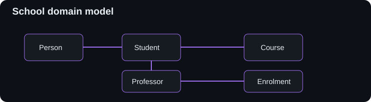

# LLD School

A small Python low-level-design exercise that models a school domain: people, addresses, students, professors, courses, and enrolments.

> Learning project — intended to demonstrate object modelling and relationships, not a production school-management system.

## Domain model



## Main entities

- `Person` and `Address`
- `Student` and `Professor` specializations
- `Course` with student limits
- `Enrol` linking students, courses, and grades

Run the example with:

```bash
python main.py
```
